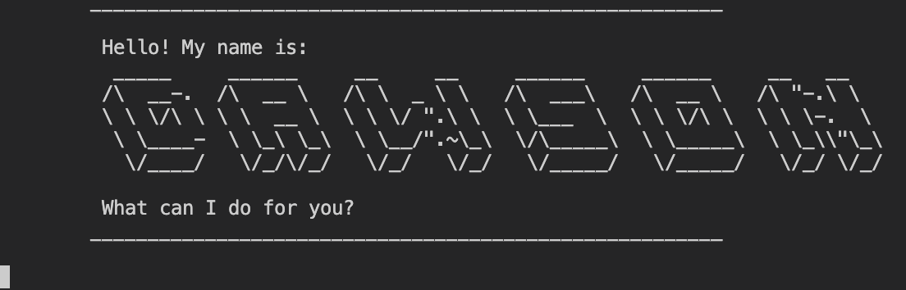
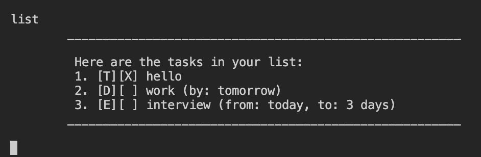
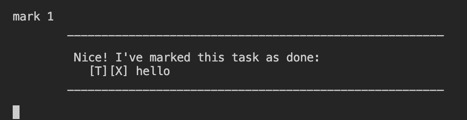
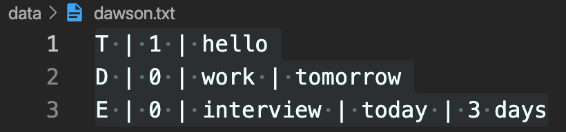

# Dawson User Guide

Dawson is a **command-line task tracking application** designed to simplify your daily task management. With Dawson, you can add todos, deadlines, and events with ease, and manage them efficiently using a variety of commands. Keep your tasks in check, mark them as completed, and find what you need quickly. Stay on top of your tasks with Dawson, your trusty CLI task tracking app.

- [Quick Start](#quick-start)
- [Features](#features)
   - Adding Tasks
      - [Add a **Todo** task: `todo`](#add-a-todo-task-todo)
      - [Add a **Deadline** task: `deadline`](#add-a-deadline-task-deadline)
      - [Add an **Event** task: `event`](#add-an-event-task-event)
   - Task Operations
      - [List all tasks: `list`](#list-all-tasks-list)
      - [Mark task as done: `mark`](#mark-task-as-done-mark)
      - [Unmark task as not done: `unmark`](#unmark-task-as-not-done-unmark)
      - [Delete a task: `delete`](#delete-a-task-delete)
   - Task Filtering
      - [Locate tasks by description: `find`](#locate-tasks-by-description-find)
      - [Find all tasks with date: `date`](#find-all-tasks-with-date-date)
   - Storage Persistence
      - [Saving the data](#saving-the-data)
      - [Editing the data file](#editing-the-data-file)
   - [Exit Dawson: `bye`](#exit-dawson-bye)
- [Command Summary](#command-summary)

## Quick Start
1. Ensure you have **Java 11 or above** installed in your computer.

2. Download the latest `Dawson.jar` from [here](https://github.com/TongZhengHong/ip/releases).

3. Open a terminal instance and navigate into the folder that contains the downloaded Dawson.jar file.

```bash
cd PATH_TO_JAR_FILE
```

4. Run the jar application with the following command:

```bash
java -jar Dawson.jar
```

You should be greeted by a welcome message from Dawson:
<div align="center">
   
</div>

## Features

> Things to note in this documentation:
>
> - Commands is **case insensitive**, Dawson will recognise commands upper or lower case or both. Example: `LIST`, `List` or `list` will be recognised as the List command.
>
> - Commands and arguments are separated by **spaces**.
>
> - **Date time format** is in the form of: `dd/MM/yyyy HHmm`. The time component is optional, so `dd/MM/yyyy` is also recognised.  Please specify the full year, for example enter **2023** instead of **23**. 
>
> - **Date formats** are in the form of: `dd/MM/yyyy`. Please specify the full year, for example enter **2023** instead of **23**.

### Add a Todo task: `todo`
Add a todo task with a description.

Format: `todo DESCRIPTION`

Example: 
- `todo project work`
- `todo homework`

### Add a Deadline task: `deadline`
Add a task with a deadline, specifying the due date and time.

Format: `deadline DESCRIPTION /by DUE_DATE_TIME`

- Insert **due date** after the **`/by`** keyword
- `DUE_DATE_TIME` take either a **string** or a **date time format**. 
   - Example: `/by today` or `/by 22/09/2023 1800` 
- If you want to store `DUE_DATE_TIME` as **date time**, please follow the format specified [above](#features). Time component is set to **23:59** by default if not specified. 

Example: 
- `deadline project work /by 22/09/2023 1800`
- `deadline meeting /by 22/09/2023` (due time default to 23:59)
- `deadline homework /by today`

### Add an Event task: `event`
Add an event task with a description and event starting and ending date and time.

Format: `event DESCRIPTION /from START_DATE_TIME /to END_DATE_TIME`

- Insert **starting** date and time after the **`/from`** keyword
- Insert **ending** date and time after the **`/to`** keyword
- Both `START_DATE_TIME` and `START_DATE_TIME` take either a **string** or a **date time format**. 
   - Example: `/from today` or `/from 22/08/2023 1800`
- If you want to store `START_DATE_TIME` or `END_DATE_TIME` as **date time**, please follow the format specified [above](#features). 
   - `START_DATE_TIME`: Time set to **00:00** by default if not specified. 
   - `END_DATE_TIME`: Time set to **23:59** by default if not specified. 

Examples:
- `event CS2113 PE /from 17/11/2023 1600 /to 17/11/2023 1800` 
- `event hackathon /from 20/11/2023 /to 25/11/2023 ` (Default start time 00:00 and end time 23:59)
- `event CS2113 tp /from Week 8 /to Week 12`

### List all tasks: `list`
View the list of tasks along with their statuses.

Format: `list`
<div align="center">
   
</div>

### Mark task as done: `mark`
Mark a task as done given a valid index.

Format: `mark INDEX`

- Marks the task at the specified INDEX as done.
- The index refers to the index number shown in the displayed task list.
- The index must be a **positive** integer 1, 2, 3, …​

Output:`X` will be marked beside the given task
<div align="center">
   
</div>

### Unmark task as not done: `unmark`
Revert a task's status to undone given a valid index.

Format: `unmark INDEX`

- Unmarks the task at the specified INDEX.
- The index refers to the index number shown in the displayed task list.
- The index must be a **positive** integer 1, 2, 3, …​

### Delete a task: `delete`
Delete a task from the list given a valid index.

Format: `delete INDEX`

- Deletes the task at the specified INDEX.
- The index refers to the index number shown in the displayed task list.
- The index must be a **positive** integer 1, 2, 3, …​

### Locate tasks by description: `find`
Search for tasks containing a specific keyword in their descriptions.

Format: `find QUERY`

- Search is **case sensitive**. e.g `hans` will **not** match `Hans`
- Only task **description** is searched.
- Matches only if description **contains** the given query string. e.g. `ello` matches `Hello world`.

### Find all tasks with date: `date`
Filter tasks by a specific date.

Format: `date QUERY_DATE`

- `QUERY_DATE` follows the date format specified [above](#features). 
- Matches **deadline** tasks if query date is the **same** as due date.
- Matches **event** tasks if query date is **within** start to end dates.
   - If `START_DATE_TIME` is not specified as date time format, Dawson will match query date with `END_DATE_TIME` and vice versa.
   - If both `START_DATE_TIME` and `END_DATE_TIME` not specified as date time, the event task will be ignored.

### Saving the data 

Dawson will save all tasks data in the hard disk automatically after each command. There is no need to save manually.

### Editing the data file

Tasks data are saved automatically in a text (.txt) file `<JAR file location>/data/dawson.json`. Users are welcome to update data directly by editing that data file.

Each line in the data file stores a task. Each task's attributes are delimited by `|`. 

- Todo: `T | IS_DONE | DESCRIPTION`
- Deadline: `D | IS_DONE | DESCRIPTION | DUE_DATE_TIME`
- Event: `E | IS_DONE | DESCRIPTION | START_DATE_TIME | END_DATE_TIME`

<div align="center">
   
   
   *Sample saved data text file*
</div>

> Note: If your changes to the data file makes its format invalid, Dawson will discard all data and start with an empty data file at the next run. Hence, it is recommended to take a backup of the file before editing it.

### Exit Dawson: `bye`
Exit the Dawson application.

Format: `bye`

## Command Summary

| Action | Format |
| --- | --- |
| Todo | `todo DESCRIPTION` |
| Deadline | `deadline DESCRIPTION /by DUE_DATE_TIME` |
| Event | `event DESCRIPTION /from START_DATE_TIME /to END_DATE_TIME` |
| Mark | `mark INDEX` |
| Unmark | `unmark INDEX` |
| Delete | `delete INDEX` |
| Find | `find QUERY` |
| Date | `date QUERY_DATE` |
| List | `list` |
| Exit | `bye` |
