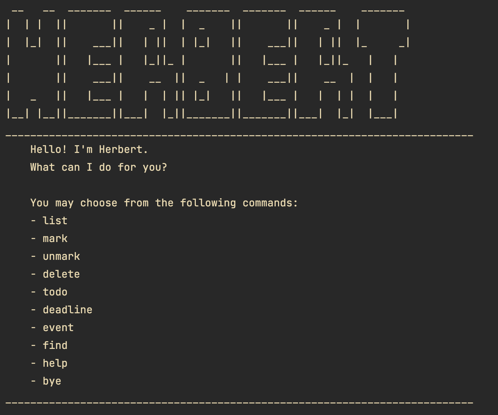

# Project Herbert

```
 __   __  _______  ______    _______  _______  ______    _______ 
|  | |  ||       ||    _ |  |  _    ||       ||    _ |  |       |
|  |_|  ||    ___||   | ||  | |_|   ||    ___||   | ||  |_     _|
|       ||   |___ |   |_||_ |       ||   |___ |   |_||_   |   |  
|       ||    ___||    __  ||  _   | |    ___||    __  |  |   |  
|   _   ||   |___ |   |  | || |_|   ||   |___ |   |  | |  |   |  
|__| |__||_______||___|  |_||_______||_______||___|  |_|  |___|  
```

Welcome to Herbert, the newest and friendliest AI assistant on the market.

## Features

Herbert's main purpose is to help you organise your life's never-ending list of todos, deadlines, and events. 

Through a simple command-line interface, you can add and remove tasks, mark tasks as complete or incomplete, and even search through your existing tasks by keyword!



### How Herbert handles tasks

There are three main types of tasks you can input into your chatbot: `Todo`, `Deadline` and `Event`. Of course, all three types must contain a description surrounding what the task entails; the distinction between the three comes with the metadata stored alongside the description. 

#### [T] Todo

A todo is the simplest type of task you can input into Herbert. All that is stored in a todo is a description of what the task is about.

e.g. `[T][ ] Put the bins out`, `[T][X] Wash the dishes`

There is no sense of time associated with the todo: only a sense of whether the task has been completed or not.

#### [D] Deadline

A deadline is a todo which has a temporal property associated with it, namely _when_ the task must be completed by.

e.g. `[D][ ] CS2113 Individual Project (by: 2023-10-06)`

A deadline must always have a due date associated with it. The due date must be specified by the user in ISO-8601 format: `YYYY-MM-DD`.

#### [E] Event

An event is a task which takes places over a period of time. Therefore, associated with each event are _two_ dates to signify the _start_ and _end_ of the task.

e.g. `[E][ ] CS2113 tP Iteration 1 (from: 2023-10-09 to: 2023-10-19)`

Both the `from` and `to` dates must be specified by the user in ISO-8601 format: `YYYY-MM-DD`.

### Local storage of tasks

Herbert wouldn't be very helpful if he forgot your list of tasks each time you restarted him! But you can rest assured that at any moment, a copy of your tasks is stored to your local hard-drive from which Herbert will automatically repopulate your task list from on startup. Whenever you add, delete, or update a task, the changes will be reflected in the local storage.

## Commands

### `list`

Lists all current tasks stored by Herbert.

Usage: `list`

### `mark`

Mark a task as completed.

- The task number must be a positive integer [1, 2, ...]

Usage: `mark <task number>`

### `unmark`

Mark a task as incomplete.

- The task number must be a positive integer [1, 2, ...]

Usage: `unmark <task number>`

### `delete`

Delete a task from the list.

- The task number must be a positive integer [1, 2, ...]

Usage: `delete <task number>`

### `todo`

Add a new todo to the list of tasks.

Usage: `todo <description>`

### `deadline`

Add a new deadline to your list of tasks. 

- Due date must be specified in YYYY-MM-DD format.

Usage: `deadline <description> /by <YYYY-MM-DD>`

### `event`

Add a new event to your list of tasks. 

- Start and end dates must be specified in YYYY-MM-DD format.

Usage: `event <description> /from <YYYY-MM-DD> /to <YYYY-MM-DD>`

### `find`

Search for keywords amongst all tasks in your list.

- The search is case-insensitive. e.g `assignment` will match `Assignment`
- The order of the keywords matters. e.g. `final exam` will not match `exam final` 
- The search query is atomic; that is, individual words in the search query are not searched for but rather the complete string.

Usage: `find <search query>`

### `help`

Show all possible user inputs with usage prompts.

Usage: `help`

### `bye`

Exit the Herbert application.

Usage: `bye`

### Command summary

| Command  | Usage                                                     |
|----------|-----------------------------------------------------------|
| list     | `list`                                                    |
| mark     | `mark <task number>`                                      |
| unmark   | `unmark <task number>`                                    |
| delete   | `delete <task number>`                                    |
| todo     | `todo <description>`                                      |
| deadline | `deadline <description> /by <YYYY-MM-DD>`                 |
| event    | `event <description> /from <YYYY-MM-DD> /to <YYYY-MM-DD>` |
| find     | `find <search query>`                                     |
| help     | `help`                                                    |
| bye      | `bye`                                                     |